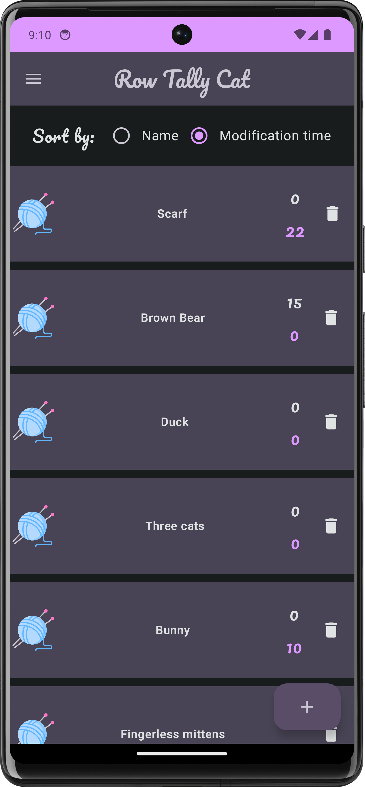

Hi, my name is Andrii, and welcome to the Row Tally Cat project! This Android app showcases my skills in Kotlin, Android SDK, and Jetpack Compose.

## What I used in this project:

- Kotlin + Coroutines
- Jetpack Compose
- Room database
- Dagger Hilt for Dependency Injection
- Coil
- DataStore Preferences
- Photo picker
- Color picker by skydoves
- androidx navigation
- clean architecture

# How to Count Rows When Knitting with an Android App

## Project overview:

Knitting is a great way to relax and create beautiful things. But it can be tricky to keep track of how many rows you've completed, especially if you're working on a large project. That's where a knitting counter app can come in handy.
My knitting counter app is a simple and easy-to-use tool that helps you keep track of your rows. When you first open the app, you'll see an empty screen with a button at the bottom to add a new project:

Click the button to open a dialog where you can enter the name of your project (required) and an optional goal, which is the number of rows you want to complete.

The newly created project will appear in a list on the main screen. You can add an unlimited number of projects.
Also, you can sort by name or modification time:

To start counting rows for a specific project, tap on the screen. The row counter will increase by one.

There are also separate buttons for resetting the counter, setting a goal, and subtracting from the counter.

The set goal dialog looks like this:

And then you will see this message:

If you set a goal, and you reach it, a dialog will appear to notify you. Let's reset the goal.

If you navigate back to the main screen, you can see saved changes for this product counter(this also works for goals):

Of course, you can delete the product, by clicking on the trash icon, and you'll see this message. If you miss-clicked you can "Undo" this deletion:

The navigation drawer helps you to navigate between different screens:

### Help Screen
The Help screen contains information on how to interact with the app. Here you can find a user guide.

### Settings Screen

The Settings screen contains display settings and counter screen settings.
#### Display Settings
The display settings allow you to change the following parameters:
- Dark mode
- Brightness level
- Display size and text etc.

If you choose dark mode, the app's appearance changes:

#### Counter Screen Settings

The counter screen settings allow you to change the following parameters:
- Background image
- Counter color
- Icons color

All changes are displayed on the preview screen, allowing the user to preview how the settings will look on the real counter screen.

For example, picking counter color:

Also, this application is available in English and Ukrainian languages.

After changing the language of the phone to Ukrainian:

Thank you for your interest in my project. Feel free to explore the code and project structure. If you have any questions or suggestions, please don't hesitate to reach out!

My contacts:

[LinkedIn](https://www.linkedin.com/in/andrii-seleznov-32142721a/) 

[Email](https://mail.google.com/mail/?view=cm&to=seleznov.andriy@gmail.com) 